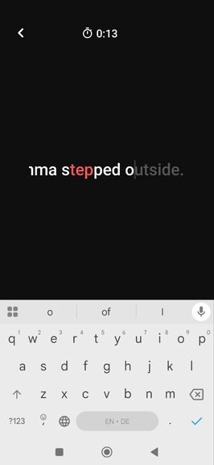
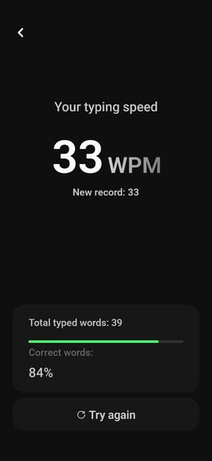

# Flow

Test you typing speed by typing the shown on the screen words.

# How does it work
You have 60 seconds and the main goal is to type as many words as you can. The cursor will move only when you type the correct character. Correct words will appear in white; incorrect ones will appear in red.

# Result
After 60 seconds, you will see how many words you typed correctly (your WPM),your record, your total word count, and your accuracy

